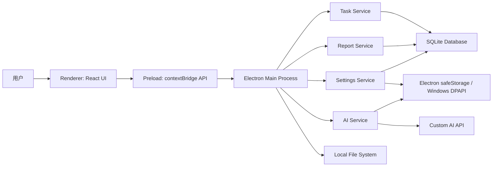
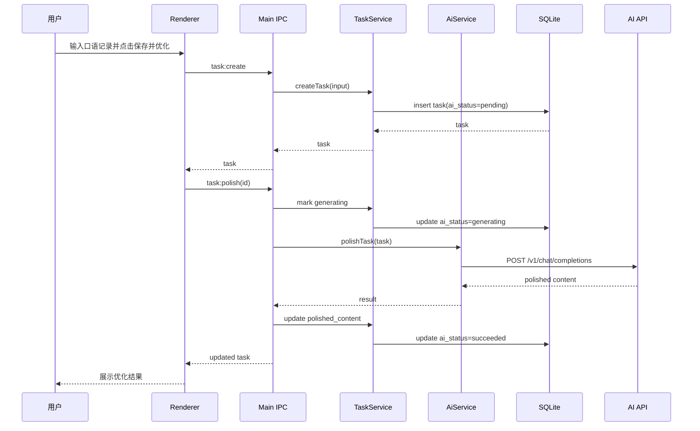
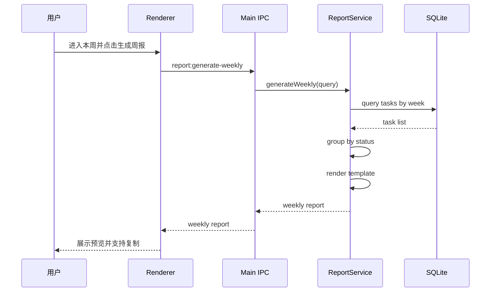

# 周报任务记录工具详细设计文档

## 1. 文档信息

| 项目 | 内容 |
| --- | --- |
| 产品名称 | 周报任务记录工具 |
| 文档版本 | V1.0 |
| 编写日期 | 2026-06-15 |
| 依据文档 | requirements.md |
| 目标平台 | Windows 10 及以上 |
| 技术路线 | Electron + React + TypeScript + SQLite + OpenAI-Compatible API |

## 2. 设计目标

1. 支持用户在 Windows 桌面环境中快速记录口语化工作事项。
2. 支持将原始记录通过 AI 大模型优化为周报可用任务条目。
3. 支持按日、周、月、年管理任务记录。
4. 支持自定义 AI API，优先兼容 OpenAI Chat Completions 协议。
5. 本地数据持久化保存，AI 服务不可用时不影响记录、编辑和查询。
6. 保持 MVP 简洁可交付，同时为模板、导出、统计、同步等后续能力保留扩展点。

## 3. 设计原则

1. 本地优先：记录、编辑、查询、导出均以本地能力为基础，不依赖 AI 服务可用性。
2. 进程隔离：Electron 主进程负责文件、数据库、系统安全存储和网络调用，渲染进程不直接访问敏感资源。
3. 可替换 AI：AI 调用层使用适配器设计，V1.0 实现 OpenAI-Compatible 适配器。
4. 数据可迁移：SQLite 表结构通过 migration 管理，后续升级可平滑迁移。
5. 输入输出可追踪：保存原始内容、AI 优化内容、AI 状态、模型名称和错误信息，便于用户回溯。
6. 界面高频友好：主界面优先服务“快速记录”和“本周整理”，减少层级跳转。

## 4. 总体架构

### 4.1 架构图



### 4.2 分层说明

| 层级 | 职责 | 主要技术 |
| --- | --- | --- |
| UI 层 | 页面展示、表单交互、列表筛选、用户操作反馈 | React、TypeScript、Ant Design、dayjs |
| Preload 层 | 暴露安全 IPC API，屏蔽 Electron 内部能力 | contextBridge、ipcRenderer |
| Main 层 | 应用生命周期、窗口管理、IPC 路由、系统能力聚合 | Electron main process |
| Service 层 | 业务逻辑，包括任务、AI、周报、设置、导出 | TypeScript |
| Repository 层 | 数据访问、事务、查询条件组装 | Drizzle ORM |
| Storage 层 | SQLite 数据库、配置、加密密钥 | SQLite、safeStorage |
| Integration 层 | AI API 请求、文件导出 | fetch、fs |

## 5. 技术选型详细说明

| 分类 | 选型 | 版本建议 | 说明 |
| --- | --- | --- | --- |
| 桌面框架 | Electron | 31+ | Windows 桌面主流方案，支持系统托盘、安装包、自动更新扩展。 |
| 前端框架 | React | 18+ | 生态成熟，适合构建任务列表、表单和设置页。 |
| 类型系统 | TypeScript | 5+ | 降低 IPC、数据模型和 AI 返回解析错误。 |
| 构建工具 | Vite | 5+ | 开发启动快，适合 Electron renderer。 |
| UI 组件 | Ant Design | 5+ | 表单、列表、日期、弹窗等组件完善，适合效率工具。 |
| 日期处理 | dayjs | 1.11+ | 轻量，支持周、月、年计算。 |
| 本地数据库 | SQLite | 3+ | 单机桌面稳定方案。 |
| ORM | Drizzle ORM | 最新稳定版 | 类型友好，适合轻量 SQLite 项目。 |
| 打包 | electron-builder | 最新稳定版 | 支持 NSIS 安装包、图标、签名和自动更新扩展。 |
| 单元测试 | Vitest | 最新稳定版 | 适配 Vite 和 TypeScript。 |
| E2E 测试 | Playwright | 最新稳定版 | 可验证 Electron 应用核心流程。 |

## 6. 推荐目录结构

```text
weekly-report/
  requirements.md
  detailed-design.md
  package.json
  electron-builder.yml
  src/
    main/
      index.ts
      window.ts
      ipc/
        task.ipc.ts
        ai.ipc.ts
        report.ipc.ts
        settings.ipc.ts
      services/
        task.service.ts
        ai.service.ts
        report.service.ts
        settings.service.ts
        export.service.ts
      repositories/
        task.repository.ts
        project.repository.ts
        settings.repository.ts
      db/
        client.ts
        schema.ts
        migrations/
      security/
        secure-store.ts
      integrations/
        ai/
          ai-adapter.ts
          openai-compatible.adapter.ts
    preload/
      index.ts
      api.types.ts
    renderer/
      main.tsx
      App.tsx
      routes/
        TodayPage.tsx
        WeekPage.tsx
        MonthPage.tsx
        YearPage.tsx
        AllRecordsPage.tsx
        ProjectsPage.tsx
        SettingsPage.tsx
      components/
        QuickInput.tsx
        TaskList.tsx
        TaskEditor.tsx
        PeriodNavigator.tsx
        FilterBar.tsx
        ReportPreview.tsx
      stores/
        task.store.ts
        settings.store.ts
      api/
        desktop-api.ts
      styles/
        global.css
    shared/
      types/
        task.ts
        ai.ts
        report.ts
        settings.ts
      constants/
        enums.ts
      utils/
        date.ts
        validation.ts
  tests/
    unit/
    e2e/
```

## 7. Electron 进程设计

### 7.1 主进程职责

1. 创建和管理主窗口。
2. 初始化数据库连接和 migration。
3. 注册 IPC handler。
4. 执行任务记录、设置、AI 调用、导出等业务服务。
5. 保存和读取本地文件。
6. 使用 `safeStorage` 处理 API Key 加密解密。

### 7.2 渲染进程职责

1. 展示页面和组件。
2. 管理表单输入、筛选条件、加载状态和错误提示。
3. 通过 preload 暴露的安全 API 调用主进程能力。
4. 不直接访问 Node.js、文件系统、数据库或 API Key。

### 7.3 Preload 暴露 API

```ts
window.weeklyReport = {
  tasks: {
    create(input),
    update(id, patch),
    remove(id),
    get(id),
    list(query),
    polish(id),
    batchPolish(ids)
  },
  reports: {
    generateWeekly(query),
    exportMarkdown(input)
  },
  settings: {
    getAll(),
    update(input),
    testAiConnection(input)
  },
  projects: {
    create(input),
    update(id, patch),
    remove(id),
    list()
  }
}
```

所有 IPC 参数必须在主进程进行二次校验，禁止渲染进程直接传入 SQL 片段、文件绝对路径或未校验的外部 URL。

## 8. 核心模块设计

### 8.1 任务模块

#### 8.1.1 职责

1. 新增、编辑、删除任务记录。
2. 查询日、周、月、年、全部任务列表。
3. 按状态、项目、标签、关键词筛选。
4. 维护任务 AI 生成状态。
5. 支持单条和批量 AI 优化。

#### 8.1.2 任务状态枚举

| 值 | 中文名 | 说明 |
| --- | --- | --- |
| completed | 已完成 | 已经完成的事项，周报中通常进入“本周完成”。 |
| in_progress | 进行中 | 正在推进的事项。 |
| planned | 计划中 | 准备做或下周计划事项。 |
| paused | 暂停 | 暂时停止处理。 |
| canceled | 取消 | 不再继续处理。 |

#### 8.1.3 AI 状态枚举

| 值 | 中文名 | 说明 |
| --- | --- | --- |
| pending | 未生成 | 已保存原文，但尚未调用 AI。 |
| generating | 生成中 | 当前正在调用 AI。 |
| succeeded | 生成成功 | 已生成可用内容。 |
| failed | 生成失败 | 调用失败或返回不可用。 |

### 8.2 周期视图模块

#### 8.2.1 日期范围计算

| 视图 | 范围规则 |
| --- | --- |
| 今日 | 当前自然日 00:00:00 至 23:59:59 |
| 本周 | 默认周一至周日，可由设置项调整每周起始日 |
| 本月 | 当前月份第一天至最后一天 |
| 本年 | 当前年份 1 月 1 日至 12 月 31 日 |
| 全部 | 不限制日期范围 |

#### 8.2.2 查询策略

1. 前端只传入视图类型、基准日期和筛选条件。
2. 主进程根据 `weekStartDay` 统一计算日期范围。
3. 数据库查询使用 `record_date >= startDate AND record_date <= endDate`。
4. 默认排序为 `record_date DESC, created_at DESC`。

### 8.3 AI 模块

#### 8.3.1 职责

1. 读取 AI 配置并解密 API Key。
2. 构造 Prompt 和 Chat Completions 请求。
3. 处理超时、鉴权失败、网络失败、返回格式异常。
4. 将 AI 结果写回任务记录。
5. 为未来非 OpenAI-Compatible API 保留适配器扩展点。

#### 8.3.2 适配器接口

```ts
export interface AiAdapter {
  testConnection(config: AiConfig): Promise<AiTestResult>;
  polishTask(input: PolishTaskInput, config: AiConfig): Promise<PolishTaskResult>;
}
```

#### 8.3.3 OpenAI-Compatible 请求

请求地址：

```text
POST {baseUrl}/v1/chat/completions
```

请求头：

```text
Authorization: Bearer {apiKey}
Content-Type: application/json
```

请求体：

```json
{
  "model": "user-configured-model",
  "temperature": 0.3,
  "max_tokens": 300,
  "messages": [
    {
      "role": "system",
      "content": "你是一个工作周报整理助手..."
    },
    {
      "role": "user",
      "content": "状态：已完成\n原始记录：今天把客户说的那个导出报错修了一下..."
    }
  ]
}
```

响应解析：

```ts
const content = response.choices?.[0]?.message?.content?.trim();
```

若 `content` 为空，记为 `failed`，错误信息为“AI 返回内容为空”。

#### 8.3.4 Prompt 设计

系统 Prompt：

```text
你是一个工作周报整理助手。请将用户输入的口语化工作记录，改写为适合周报使用的一条正式工作任务描述。

要求：
1. 保留原始含义，不编造事实。
2. 表达简洁、正式、结果导向。
3. 输出一条中文任务描述，不要解释。
4. 根据用户标记的状态调整措辞：已完成、进行中、计划中、暂停、取消。
5. 如果原文信息不足，保持概括，不要补充不存在的细节。
6. 避免无依据的夸大描述，例如“显著提升”“全面优化”。
```

用户 Prompt：

```text
任务状态：{statusLabel}
记录日期：{recordDate}
项目：{projectNameOrEmpty}
原始记录：{rawContent}

请输出一条周报可用任务描述。
```

### 8.4 周报模块

#### 8.4.1 职责

1. 获取指定周的任务记录。
2. 按状态组织任务内容。
3. 生成可复制的周报文本。
4. 支持 Markdown 导出。
5. 预留自定义模板能力。

#### 8.4.2 默认周报模板

```md
# 周报（{startDate} - {endDate}）

## 本周完成

{completedItems}

## 进行中

{inProgressItems}

## 下周计划

{plannedItems}

## 问题与风险

{riskItems}
```

V1.0 先根据状态生成前三类。问题与风险可在后续通过任务类型或标签扩展。

### 8.5 设置模块

#### 8.5.1 职责

1. 管理 AI API 配置。
2. 管理默认任务状态、每周起始日、默认 AI 输出风格。
3. 管理周报模板。
4. 提供 AI 连接测试。
5. 处理敏感配置的加密存储。

#### 8.5.2 AI 配置项

| 配置项 | 类型 | 默认值 | 是否敏感 | 说明 |
| --- | --- | --- | --- | --- |
| ai.baseUrl | string | 空 | 否 | AI 服务地址，不包含尾部 `/v1/chat/completions` 也可兼容。 |
| ai.apiKey | string | 空 | 是 | 使用 safeStorage 加密保存。 |
| ai.model | string | 空 | 否 | 用户填写的模型名称。 |
| ai.temperature | number | 0.3 | 否 | 控制输出稳定性。 |
| ai.maxTokens | number | 300 | 否 | 单条任务优化的最大输出 token。 |
| ai.timeoutMs | number | 60000 | 否 | 请求超时时间。 |
| ai.outputStyle | string | concise | 否 | 简洁、正式、量化、管理汇报等。 |
| app.weekStartDay | number | 1 | 否 | 1 表示周一，0 表示周日。 |
| task.defaultStatus | string | completed | 否 | 快速记录默认状态。 |

## 9. 数据库设计

### 9.1 数据库位置

默认数据库文件：

```text
%APPDATA%/WeeklyReportTool/app.db
```

开发环境可使用：

```text
./data/dev.db
```

### 9.2 表结构

#### 9.2.1 task_records

```sql
CREATE TABLE task_records (
  id TEXT PRIMARY KEY,
  raw_content TEXT NOT NULL,
  polished_content TEXT,
  status TEXT NOT NULL,
  record_date TEXT NOT NULL,
  project_id TEXT,
  tags_json TEXT NOT NULL DEFAULT '[]',
  priority TEXT,
  ai_model TEXT,
  ai_status TEXT NOT NULL DEFAULT 'pending',
  ai_error TEXT,
  created_at TEXT NOT NULL,
  updated_at TEXT NOT NULL,
  deleted_at TEXT,
  FOREIGN KEY (project_id) REFERENCES projects(id)
);
```

索引：

```sql
CREATE INDEX idx_task_records_record_date ON task_records(record_date);
CREATE INDEX idx_task_records_status ON task_records(status);
CREATE INDEX idx_task_records_project_id ON task_records(project_id);
CREATE INDEX idx_task_records_deleted_at ON task_records(deleted_at);
```

说明：

1. 使用软删除字段 `deleted_at`，避免误删后无法恢复，V1.0 可不提供恢复 UI。
2. `record_date` 使用 `YYYY-MM-DD` 字符串，便于 SQLite 范围查询。
3. `tags_json` 使用 JSON 字符串保存，MVP 降低表结构复杂度。

#### 9.2.2 projects

```sql
CREATE TABLE projects (
  id TEXT PRIMARY KEY,
  name TEXT NOT NULL,
  description TEXT,
  color TEXT,
  created_at TEXT NOT NULL,
  updated_at TEXT NOT NULL,
  deleted_at TEXT
);
```

索引：

```sql
CREATE UNIQUE INDEX idx_projects_name_active
ON projects(name)
WHERE deleted_at IS NULL;
```

#### 9.2.3 app_settings

```sql
CREATE TABLE app_settings (
  key TEXT PRIMARY KEY,
  value TEXT,
  encrypted INTEGER NOT NULL DEFAULT 0,
  updated_at TEXT NOT NULL
);
```

#### 9.2.4 ai_request_logs

```sql
CREATE TABLE ai_request_logs (
  id TEXT PRIMARY KEY,
  task_id TEXT,
  provider TEXT NOT NULL,
  model TEXT NOT NULL,
  request_type TEXT NOT NULL,
  status TEXT NOT NULL,
  error_message TEXT,
  duration_ms INTEGER,
  created_at TEXT NOT NULL,
  FOREIGN KEY (task_id) REFERENCES task_records(id)
);
```

说明：

1. 不保存完整 Prompt 和 API Key，避免敏感信息泄漏。
2. 仅记录模型、状态、耗时和错误摘要，用于排查问题。

### 9.3 数据迁移

1. 使用 Drizzle migration 管理表结构。
2. 应用启动时主进程执行 migration。
3. migration 失败时阻止进入主界面，并展示错误提示。
4. 每次发布前固定 migration 文件，不允许修改已发布 migration。

## 10. TypeScript 类型设计

### 10.1 TaskRecord

```ts
export type TaskStatus = 'completed' | 'in_progress' | 'planned' | 'paused' | 'canceled';
export type AiStatus = 'pending' | 'generating' | 'succeeded' | 'failed';

export interface TaskRecord {
  id: string;
  rawContent: string;
  polishedContent: string | null;
  status: TaskStatus;
  recordDate: string;
  projectId: string | null;
  tags: string[];
  priority: 'low' | 'medium' | 'high' | null;
  aiModel: string | null;
  aiStatus: AiStatus;
  aiError: string | null;
  createdAt: string;
  updatedAt: string;
}
```

### 10.2 查询参数

```ts
export interface TaskListQuery {
  periodType?: 'day' | 'week' | 'month' | 'year' | 'all';
  baseDate?: string;
  startDate?: string;
  endDate?: string;
  statuses?: TaskStatus[];
  projectId?: string;
  tags?: string[];
  keyword?: string;
  limit?: number;
  offset?: number;
}
```

### 10.3 AI 配置

```ts
export interface AiConfig {
  baseUrl: string;
  apiKey: string;
  model: string;
  temperature: number;
  maxTokens: number;
  timeoutMs: number;
  outputStyle: 'concise' | 'formal' | 'quantified' | 'managerial';
}
```

## 11. IPC 接口设计

### 11.1 任务接口

| Channel | 入参 | 出参 | 说明 |
| --- | --- | --- | --- |
| task:create | CreateTaskInput | TaskRecord | 创建任务。 |
| task:update | { id, patch } | TaskRecord | 更新任务。 |
| task:remove | { id } | { success } | 软删除任务。 |
| task:get | { id } | TaskRecord | 查询单条任务。 |
| task:list | TaskListQuery | TaskListResult | 查询任务列表。 |
| task:polish | { id } | TaskRecord | 单条 AI 优化。 |
| task:batch-polish | { ids } | BatchPolishResult | 批量 AI 优化。 |

### 11.2 设置接口

| Channel | 入参 | 出参 | 说明 |
| --- | --- | --- | --- |
| settings:get-all | void | AppSettings | 获取设置，API Key 脱敏返回。 |
| settings:update | UpdateSettingsInput | AppSettings | 更新设置。 |
| settings:test-ai | AiConfigInput | AiTestResult | 测试 AI 连接。 |

### 11.3 周报接口

| Channel | 入参 | 出参 | 说明 |
| --- | --- | --- | --- |
| report:generate-weekly | WeeklyReportQuery | WeeklyReport | 生成周报文本。 |
| report:export-markdown | ExportMarkdownInput | ExportResult | 导出 Markdown 文件。 |

### 11.4 IPC 错误格式

```ts
export interface AppError {
  code: string;
  message: string;
  details?: unknown;
}
```

常见错误码：

| 错误码 | 说明 |
| --- | --- |
| VALIDATION_ERROR | 入参不合法。 |
| TASK_NOT_FOUND | 任务不存在或已删除。 |
| AI_CONFIG_MISSING | AI 配置不完整。 |
| AI_AUTH_FAILED | AI 鉴权失败。 |
| AI_TIMEOUT | AI 请求超时。 |
| AI_RESPONSE_INVALID | AI 返回格式异常。 |
| DB_ERROR | 数据库异常。 |
| EXPORT_FAILED | 导出失败。 |

## 12. 页面设计

### 12.1 应用布局

```text
+---------------------------------------------------------+
| 顶部栏：应用名称 / 当前周期 / 快速操作 / 设置入口       |
+-----------+---------------------------------------------+
| 左侧导航  | 快速输入区                                  |
| 今日      |---------------------------------------------|
| 本周      | 筛选栏                                      |
| 本月      |---------------------------------------------|
| 本年      | 任务列表                                    |
| 全部记录  |                                             |
| 项目      |                                             |
| 设置      |                                             |
+-----------+---------------------------------------------+
```

### 12.2 快速输入区

组件：`QuickInput`

字段：

1. 原始记录多行文本框。
2. 状态选择。
3. 日期选择。
4. 项目选择。
5. 标签输入。
6. “保存”按钮。
7. “保存并 AI 优化”按钮。

交互规则：

1. 原始记录不能为空。
2. 默认日期为今天。
3. 默认状态读取 `task.defaultStatus`。
4. “保存并 AI 优化”先保存本地记录，再异步调用 AI。
5. AI 生成中任务列表显示状态标签，用户可以继续输入下一条。

### 12.3 任务列表

组件：`TaskList`

展示字段：

1. 日期。
2. 状态。
3. 周报条目，优先展示 `polishedContent`，为空时展示 `rawContent`。
4. 项目。
5. 标签。
6. AI 状态。
7. 操作：编辑、重新优化、删除。

交互规则：

1. 点击任务打开右侧编辑面板或弹窗。
2. 删除需要二次确认。
3. AI 失败时展示错误摘要和“重试”按钮。
4. 支持按关键词搜索原文和优化后内容。

### 12.4 任务编辑

组件：`TaskEditor`

字段：

1. 原始记录。
2. 周报条目。
3. 状态。
4. 日期。
5. 项目。
6. 标签。
7. 优先级。
8. AI 状态和错误信息。

保存规则：

1. 修改原始记录不会自动覆盖周报条目。
2. 用户可点击“重新 AI 优化”基于最新原始记录生成新条目。
3. 用户手动编辑周报条目后直接保存。

### 12.5 周视图

重点服务周报整理：

1. 默认进入当前周。
2. 展示本周任务统计：总数、已完成、进行中、计划中、AI 失败数。
3. 支持生成周报预览。
4. 支持复制周报文本。
5. 支持导出 Markdown。

### 12.6 设置页

分区：

1. AI 配置：Base URL、API Key、Model、temperature、max tokens、timeout。
2. 生成风格：简洁、正式、量化、管理汇报。
3. 默认偏好：每周起始日、默认任务状态。
4. 周报模板：V1.0 可提供默认模板编辑框。
5. 数据管理：V1.0 可预留入口，MVP 后实现备份恢复。

## 13. 核心流程设计

### 13.1 保存并 AI 优化



失败处理：

1. AI 配置缺失：任务保存成功，AI 状态更新为 `failed`。
2. 请求超时：记录错误码 `AI_TIMEOUT`，保留原文，允许重试。
3. 返回为空：记录错误码 `AI_RESPONSE_INVALID`。
4. 用户关闭应用：已保存任务不丢失，未完成 AI 请求可中断。

### 13.2 生成周报



## 14. AI 安全和隐私设计

1. API Key 不在渲染进程持久保存。
2. 设置页展示 API Key 时只显示脱敏文本，例如 `sk-****abcd`。
3. 使用 Electron `safeStorage` 加密 API Key；Windows 下依赖系统安全能力。
4. 如果 `safeStorage.isEncryptionAvailable()` 为 false，则提示用户当前环境无法安全保存密钥，并允许仅本次会话使用。
5. AI 请求日志不保存原始 API Key。
6. AI 请求默认只发送用户选中或正在优化的任务内容，不上传全部历史记录。
7. 导出文件路径由系统保存对话框选择，主进程校验写入结果。

## 15. AI 配置兼容性设计

### 15.1 Base URL 规范化

用户可能填写：

```text
https://api.example.com
https://api.example.com/v1
https://api.example.com/v1/chat/completions
```

系统处理规则：

1. 如果以 `/chat/completions` 结尾，直接作为请求地址。
2. 如果以 `/v1` 结尾，追加 `/chat/completions`。
3. 其他情况追加 `/v1/chat/completions`。
4. 保存原始 Base URL，运行时计算最终请求地址。

### 15.2 连接测试

测试请求使用一条极短输入：

```text
把“修复登录问题”改写成周报任务。
```

成功条件：

1. HTTP 状态码为 2xx。
2. 返回存在 `choices[0].message.content`。
3. 内容非空。

失败提示：

| 场景 | 提示 |
| --- | --- |
| 401/403 | API Key 无效或无权限。 |
| 404 | API 地址可能不正确，请检查 Base URL。 |
| 429 | 请求过于频繁或额度不足。 |
| 5xx | AI 服务异常，请稍后重试。 |
| timeout | 请求超时，请检查网络或提高超时时间。 |
| parse error | 返回格式不兼容 OpenAI Chat Completions。 |

## 16. 周报导出设计

### 16.1 复制到剪贴板

由渲染进程使用浏览器 Clipboard API 复制周报文本。失败时提示用户手动选择复制。

### 16.2 Markdown 导出

流程：

1. 用户点击“导出 Markdown”。
2. 主进程打开保存文件对话框。
3. 默认文件名：`周报_YYYY-MM-DD_YYYY-MM-DD.md`。
4. 写入 UTF-8 Markdown 内容。
5. 成功后提示保存路径。

### 16.3 Word 导出扩展

V1.0 非必需。后续可选方案：

1. 使用 HTML 转 DOCX。
2. 使用模板引擎生成 DOCX。
3. 保持 Markdown 为主输出，Word 作为增强功能。

## 17. 性能设计

1. 任务列表默认分页，每页 50 条。
2. 周、月、年视图只查询当前范围内任务。
3. 搜索关键词使用 `LIKE`，记录量大后可扩展 SQLite FTS5。
4. AI 调用异步执行，不阻塞 UI 输入。
5. 批量 AI 优化限制并发数，默认 2 个并发，避免触发接口限流。
6. 数据库写操作使用事务，避免半完成状态。
7. 应用启动只加载必要设置和当前周期任务，不一次性加载全部历史记录。

## 18. 可用性设计

1. 应用启动后默认进入“本周”视图。
2. 快速输入框始终在主要页面顶部可见。
3. 输入后按 `Ctrl + Enter` 可执行“保存并 AI 优化”。
4. AI 失败不弹出阻断式提示，在任务行展示失败状态。
5. 周报条目允许用户手动编辑，AI 只是辅助。
6. 空状态提供直接输入入口，不展示冗长说明。
7. 删除任务必须二次确认。

## 19. 异常处理设计

| 异常 | 处理方式 |
| --- | --- |
| 数据库初始化失败 | 展示错误页，提示重启或检查权限。 |
| migration 失败 | 阻止进入应用，记录日志。 |
| AI 配置缺失 | 保存任务成功，AI 状态置为失败并提示配置。 |
| AI 请求失败 | 保存错误摘要，允许重试。 |
| 导出失败 | 展示失败原因，不影响已有数据。 |
| 设置保存失败 | 回滚 UI 状态并提示。 |
| 应用异常退出 | 下次启动正常读取已提交数据。 |

## 20. 日志设计

### 20.1 日志范围

1. 应用启动、退出。
2. 数据库 migration 结果。
3. AI 请求成功、失败、耗时。
4. 导出成功、失败。
5. 未捕获异常。

### 20.2 日志限制

1. 不记录 API Key。
2. 不默认记录完整原始任务内容。
3. 日志按日期切分，保留最近 14 天。
4. 日志位置：

```text
%APPDATA%/WeeklyReportTool/logs/
```

## 21. 测试设计

### 21.1 单元测试

| 模块 | 测试重点 |
| --- | --- |
| date utils | 日、周、月、年范围计算，每周起始日配置。 |
| task service | 创建、更新、删除、筛选、软删除。 |
| report service | 周报分组、模板渲染、空数据处理。 |
| ai adapter | Base URL 规范化、响应解析、错误映射。 |
| settings service | API Key 加密、脱敏、配置合并。 |

### 21.2 集成测试

1. 使用临时 SQLite 数据库执行完整 CRUD。
2. 模拟 AI API 成功、超时、鉴权失败、返回为空。
3. 验证任务保存后 AI 失败不会丢失原始记录。
4. 验证周报生成内容和任务状态分组一致。

### 21.3 E2E 测试

1. 首次打开应用并进入本周视图。
2. 新增任务并保存。
3. 配置模拟 AI API 并测试连接。
4. 保存并 AI 优化。
5. 编辑优化后的任务条目。
6. 生成周报并复制。
7. 关闭应用后重新打开，确认记录仍存在。

## 22. 打包与发布设计

### 22.1 打包目标

| 目标 | 说明 |
| --- | --- |
| Windows x64 NSIS 安装包 | 普通用户安装使用。 |
| Windows portable | 可选，便于内部测试。 |

### 22.2 electron-builder 配置要点

1. 应用名称：Weekly Report Tool 或中文名称“周报任务记录工具”。
2. App ID：`com.weeklyreport.tool`。
3. 输出目录：`dist/`。
4. 安装包支持桌面快捷方式。
5. 数据库和用户配置放在用户数据目录，不随卸载包覆盖。
6. 后续如分发给外部用户，应考虑代码签名。

## 23. 开发阶段拆分

### 23.1 M1 工程骨架

1. 初始化 Electron + React + TypeScript + Vite 项目。
2. 配置 Ant Design。
3. 完成主窗口、preload 和 IPC 示例。
4. 接入 SQLite 和 migration。

### 23.2 M2 任务记录 MVP

1. 实现任务表和项目表。
2. 实现任务 CRUD。
3. 实现今日、本周、本月、本年和全部记录视图。
4. 实现筛选、搜索、删除确认。

### 23.3 M3 AI 优化

1. 实现 AI 设置页。
2. 实现 API Key 加密保存。
3. 实现 OpenAI-Compatible 适配器。
4. 实现单条任务 AI 优化和失败重试。

### 23.4 M4 周报生成和导出

1. 实现周报生成。
2. 实现复制周报文本。
3. 实现 Markdown 导出。
4. 完成核心流程 E2E 测试。

### 23.5 M5 打包和验收

1. 配置 electron-builder。
2. 生成 Windows 安装包。
3. 完成验收用例。
4. 修复稳定性和可用性问题。

## 24. 需求追踪矩阵

| 需求编号 | 设计覆盖 |
| --- | --- |
| FR-001 至 FR-010 | 任务模块、数据库 task_records、任务 IPC、任务列表和编辑器。 |
| FR-011 至 FR-018 | 周期视图模块、日期范围计算、筛选栏、统计展示。 |
| FR-019 至 FR-026 | AI 模块、AI 适配器、Prompt 设计、AI 状态和失败重试。 |
| FR-027 至 FR-034 | 设置模块、AI 配置项、安全存储、连接测试和适配器扩展。 |
| FR-035 至 FR-040 | 周报模块、默认模板、复制、Markdown 导出和 Word 扩展方案。 |
| FR-041 至 FR-045 | 设置模块、默认偏好、版本信息和数据管理扩展。 |
| NFR-001 | Electron Windows 打包目标。 |
| NFR-002 | 启动加载策略和性能设计。 |
| NFR-003 | 分页、索引、查询策略。 |
| NFR-004 | SQLite 持久化、事务和 migration。 |
| NFR-005 | safeStorage、脱敏显示和安全日志。 |
| NFR-006 | AI timeout 配置。 |
| NFR-007 至 NFR-008 | 本地优先和 AI 失败降级。 |
| NFR-009 | 页面布局和可用性设计。 |

## 25. 待确认设计项

1. 产品正式名称是否使用“周报任务记录工具”。
2. V1.0 是否必须支持项目管理，还是只保留项目字段。
3. 周报模板是否固定为“本周完成 / 进行中 / 下周计划”。
4. 是否需要在 MVP 中实现系统托盘和快捷键唤起。
5. 是否需要导入历史记录，例如从 Markdown、Excel 或剪贴板批量导入。

## 26. MVP 最小实现清单

1. Electron 应用工程。
2. React 主界面和本周视图。
3. 快速输入和任务列表。
4. SQLite 数据库和 `task_records` 表。
5. 任务新增、编辑、删除、查询。
6. AI 设置页。
7. OpenAI-Compatible 单条任务优化。
8. 周报文本生成和复制。
9. Markdown 导出。
10. Windows 安装包。
